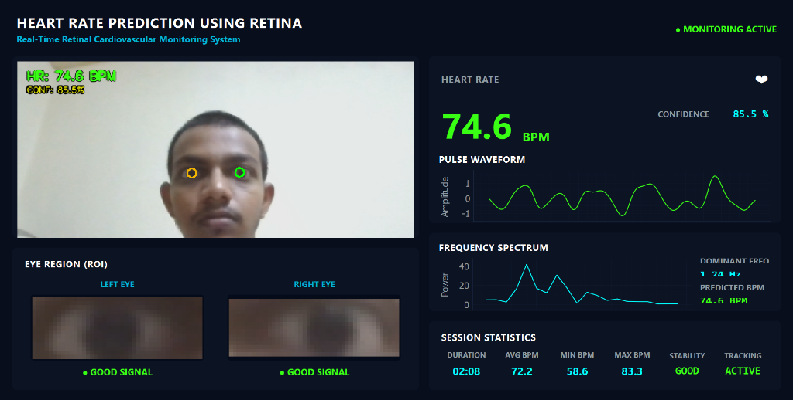

# Heart Rate Prediction Using Retina

A real-time computer vision application that estimates heart rate (BPM) using eye-region analysis from a webcam feed. The system tracks the eye region, processes color intensity variations, and predicts heart rate using signal processing techniques.

---

## Output



---

## Features

- Real-time webcam monitoring
- Eye region detection and tracking
- Heart rate (BPM) prediction
- Confidence score estimation
- Pulse waveform visualization
- Frequency spectrum analysis
- Session statistics dashboard
- Modern dark-themed GUI

---

## Technologies Used

- Python
- OpenCV
- MediaPipe
- NumPy
- SciPy
- PyQt5
- PyQtGraph

---

## Project Structure

```text
Heart Rate Prediction Using Retina/
│
├── main.py
├── requirements.txt
├── README.md
│
└── src/
    ├── camera.py
    ├── face_detector.py
    ├── eye_detector.py
    ├── retina_analyzer.py
    ├── signal_processor.py
    ├── bpm_predictor.py
    ├── graphs.py
    └── ui.py
```

---

## Installation

Clone the repository:

```bash
git clone <repository-url>
cd Heart-Rate-Prediction-Using-Retina
```

Install dependencies:

```bash
pip install -r requirements.txt
```

---

## Run the Application

```bash
python main.py
```

---

## How It Works

1. Captures video from the webcam.
2. Detects and tracks the eye region.
3. Extracts color intensity variations from the detected region.
4. Applies signal processing techniques to reduce noise.
5. Performs frequency analysis to estimate heart rate.
6. Displays BPM, confidence score, waveform, and statistics in real time.

---

## Future Enhancements

- Improved heart rate estimation accuracy
- Support for multiple users
- Data logging and export
- Mobile application integration
- Cloud-based monitoring

---
